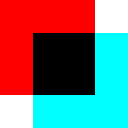

# Overlay

Overlay is a set of tools for developers and designers to measure, align and overlay on-screen graphics and layouts. Similar to [xScope](https://xscopeapp.com/) but with a simple interface, limited functionality and open source.

[Download](https://github.com/singuerinc/overlay/releases) (Mac only)

## Goals

- Minimal interface
- Simple to use
- Free - always

## Toolbox

From the toolbox you can manage, add tools, display the help page, and show or hide all the items in the screen.

## Tools

### Guides

Horizontal and vertical guides are useful when you need to align several items in the same axis.

### Rulers

Rulers are great to measure objects, they are semi-transparent, in different colors, and can be cloned.

### Onion images

The onion image serve as a visual guide to match a layout. Opacity and inverted colors can be applied.

### The Grid

The grid is similar to the ruler but covers the whole screen and has no background color. It is a 10x10 pixels fixed grid but that value can be defined in the settings.

### Columns

In progress. Not ready yet.
